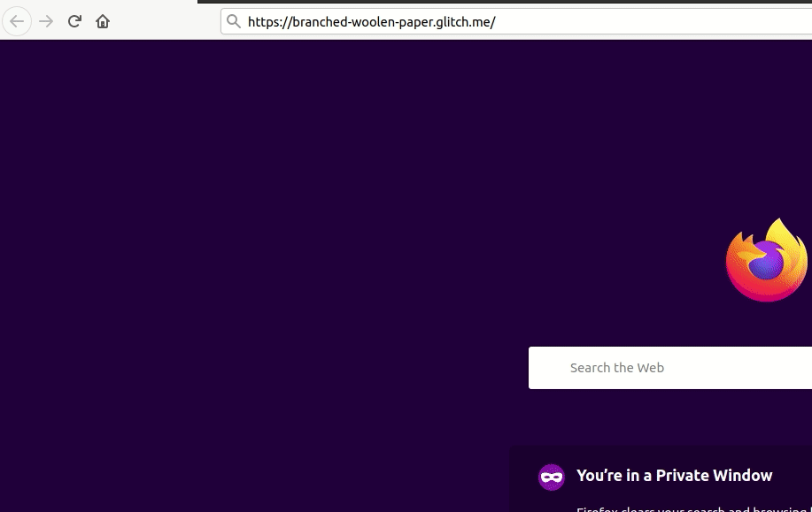

# Timestamp mircroservice

[Live site on Glitch](https://branched-woolen-paper.glitch.me/)  

  

## Instructions
Enter a time at the end of the site after /api/timestamp  
The time must be in the format Year-Month-Date or in unix time  

Example Usage  
https://branched-woolen-paper.glitch.me/api/timestamp/2015-12-25  
https://branched-woolen-paper.glitch.me/api/timestamp/1451001600000  
Example Output  
{"unix":1451001600000, "utc":"Fri, 25 Dec 2015 00:00:00 GMT"}  

## Built With

* [Node JS](https://nodejs.org/en/)  

## Acknowledgments

* This project idea is from freeCodeCamp    
